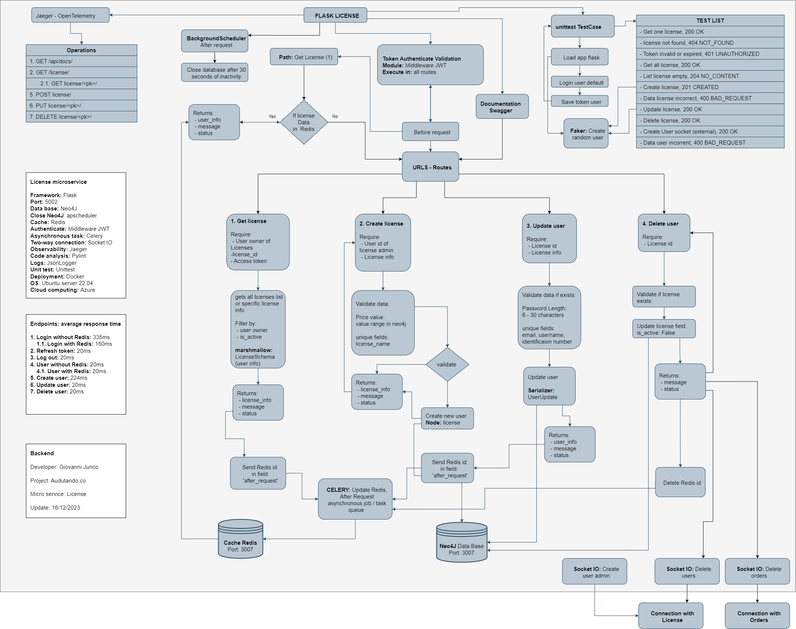

# Auditando.co License

Complex schemes in Neo4J between licenses and their relationships with users, orders and files


## General diagram


## Specific diagram


## Environment Variables

To run this project, you will need to add the following environment variables to your .env file

`HOST_SQL`

`USER_SQL`

`PWD_SQL`


## Installation

Install project with python and virtualenv

Windows
```bash
  python -m venv .license_env
  .license_env\Scripts\activate
  pip install -r requirements.txt
  python app.py

```

Linux
```bash
  virtualenv .license_env
  source .license_env/bin/activate
  pip3 install -r requirements.txt
  python3 app.py
```

## pylint

```bash
  python -m pylint .\app.py

  cd api
  pylint_runner
```

## unitest

```bash
  python -m unittest api\test\test_license.py
```
## Tech Stack


**Server:** Python, Flask

## neo4j

instalar neo4j en windows

https://neo4j.com/download-thanks-desktop/?edition=desktop&flavour=windows&release=1.5.9&offline=true

https://www.youtube.com/watch?v=x6yiZes6Qls&ab_channel=Isa%C3%ADAvenda%C3%B1o

name: DB_license_auditando
usuario: neo4j
password: 1234abcd

http://localhost:7474/browser/

## Cypher Query Language

ver todos los nodos
match (n) return n

VER POR ID

MATCH (n) WHERE id(n)=0 or id(n)=1 RETURN n

MATCH (n) WHERE user_owner(n)=1 RETURN n

MATCH (a:License WHERE a.user_owner = 1) RETURN a
crear nodo
create (miriam:persona {name: "Miriam"})
create (n:License{NAME:"Gestion Financiera",ID:1})

CREAR VARIOS
create (node3:License{NAME:"girag",user_owner:1}), (node4:License{NAME:"rac2",user_owner:2})

Eliminar todos los nodos
match (n) detach delete (n)
match (n) delete (n)

create (n1:License{NAME:"Racsas",user_owner:1}), (n4:License{NAME:"rac2",user_owner:2})

Crear relaciones entre dos nodos

MATCH (a),(b) where a.NAME="rac1" and b.NAME="rac2" CREATE (a)-[:knows]->(b)
MATCH (a),(b) where a.NAME="rac2" and b.NAME="rac1" CREATE (a)-[:orders]->(b)
MATCH (a),(b) where a.NAME="Gestion Financiera" and b.NAME="rac2" CREATE (a)-[:users]->(b)

crear multiple nodes (10)
foreach (i in RANGE(0, 9)|create (n))

ver usuarios:
SHOW CURRENT USER

CREATE USER admin_license SET PASSWORD 'Abcd1234'


--
create (n1:License{NAME:"Racsas",user_owner:1,  orders_quantity:20, users_quantity:30,
                pesos_col:200000, createdAt:"2024-01-15T14:04:37.270393",
                is_active:true, is_banned:false, modifie:"2024-02-01T10:24:02.860393"})

create (u:User{NAME:"Sandra"})

create (o:Order{NAME:"Gestion auditar"})

create (o:Order{NAME:"Inucar"})

create (o:Forms{NAME:"P1 - Actividades previas a la auditoria"})

create (o:Files{NAME:"Consulta Listas Restrictivas.xlsx"})

Planeación
P1 - Actividades previas a la auditoria	
P2 - Equipo de Auditoria	
P3 - Certificados de independencia	
P4 - Certificados de confidencialidad	
P5 - Materialidad	
P6 - Carta de apertura (kick off)	
P7 - Evaluación Control Interno (Matriz)	
P8 - Prueba de los controles

MATCH (a),(b) where a.NAME="Racsas" and b.NAME="Sandra" CREATE (a)-[:license_owner]->(b)

MATCH (a),(b) where a.NAME="Juan" and b.NAME="Racsas" CREATE (a)-[:user_belongs]->(b)

MATCH (a),(b) where a.NAME="Empresa Auditar" and b.NAME="Racsas" CREATE (a)-[:user_belongs]->(b)

MATCH (a),(b) where a.NAME="Giovanni" and b.NAME="Sandra" CREATE (a)-[:creator_user]->(b)

MATCH ()-[r:forms_order]-() DELETE r

MATCH (a),(b) where a.NAME="SolinSas" and b.NAME="Giovanni" CREATE (a)-[:creator_user]->(b)

MATCH (a),(b) where a.NAME="SolinSas" and b.NAME="Racsas" CREATE (a)-[:order_belongs]->(b)
MATCH (a),(b) where a.NAME="NeoEnterpriser" and b.NAME="Racsas" CREATE (a)-[:order_belongs]->(b)

MATCH (a),(b) where a.NAME="P8 - Prueba de los controles" and b.NAME="Racsas" CREATE (a)-[:forms_order]->(b)

MATCH (a),(b) where a.NAME="PropuestaRevisatoria.pdf" and b.NAME="P1 - Actividades previas a la auditoria" CREATE (a)-[:files_form]->(b)

match (n) WHERE elementid(n)=4:19d057a5-7efb-4ec1-b6f1-ed19c84a7472:0 detach delete (n)

CREATE (n:user {name: 'User A'})-[:USER_BELONGS {role: 'license owner'}]->(n:license {title: 'License'})<-[:USER_BELONGS]-(n:order {name: 'User B'})

create (o:user{NAME:"User N"})

MATCH (a),(b) where a.NAME="User N" and b.NAME="License" CREATE (a)-[:USER_BELONGS]->(b)